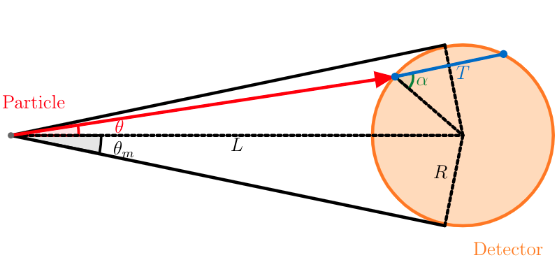

<!--
 * @Description: 
 * @Author: Ming Fang
 * @Date: 1969-12-31 18:00:00
 * @LastEditors: Ming Fang
 * @LastEditTime: 2021-11-02 15:51:36
-->
# CFD
The CFD algorithm consists of two parts, one responsible for tracking of particles in the materials, the other responsible for calculating the contributions of scttered particle to the detector volume. The structure is as following:
1. Create a particle from the source
2. *Perform CFD of the primary particle*
3. Move the particle to a new position where a scattering interaction is going to happen using the delta-tracking algorithm. Check if the particle is still within the ROI and if its energy/weight is above the rejection threshold. If not, go to step 1.
4. *Perform CFD of the scattered particle*
5. Update the energy and moving direction of the particle by sampling them from the differential cross-section. Go to step 3.

CFD calculations are performed at step 2 and step 4, where a copy of the particle is sent to the CFD subroutine, without interfereing the tracking of the particle.

In the next sections, we first describe the particle tracking methods for gamma-rays and neutrons (both fast and slow), and then we describe the CFD calculation algorithms.

## Particle Tracking

### Delta-tracking algorithm
Delta-tracking algorithm is used to sample the distance that the particle will travel along its current moving direction before the next interaction happens [1]. Let $u_{max}(E)$ be the maximum of the total macroscopic cross-sections of all materials, where $E$ is the particle's energy. The distance is sampled as follows:

1. Let the particle move by a distance $d = -\ln(\xi)/u_{max}(E)$, where $\xi$ is random number sampled from $U(0,1)$.
2. If the particle is not in ROI, exit.
3. Let $u_i(E)$ be the attenuation coefficient of the material where the particle is now at. If $\xi < u_i(E) / u_{max}(E)$, exit; else, go back to step 1. 

### Scattering Simulation

After delta-tracking, the particle is now going to interact with the material at current position. we need to sample a new energy and a scattering angle from the differential cross-section of the material. Three cases are discussed below.

#### Gamma-rays
We first force this interaction to be Compton scattering, by multiplying its weight by the factor
$$
\frac{\sigma_s(E)}{\sigma_{tot}(E)}
$$
where $\sigma_s$ is the Compton scattering cross-section, and $\sigma_{tot}$ is the total cross-section.

For gamma-rays, the Compton scattering differential cross-section is given by the Klein-Nishina equation:
$$
\frac{d^2\sigma}{dEd\mu} = K\left(\frac{E(\mu)}{E_0}\right)^2 \left[\frac{E(\mu)}{E_0}+\frac{E_0}{E(\mu)}+1-\mu^2\right] \delta(E-E(\mu))
$$
$$
E(\mu) = \frac{E_0}{1+\alpha (1-\mu)}, \alpha = \frac{E_0}{m_e c^2}
$$
where $K$ is a constant, $E_0$ is the photon energy before scattering, $E$ is the photon energy after scattering, $m_ec^2$ is 511 keV. Kahn's rejection algorithm is used to sample the energy $E$ and scattering angle $\mu$ from the differential cross-section [2].
#### Fast neutrons
For neutrons, we first need to sample the nuclide that neutron is going to interact with. Let $\Sigma_{tot}^j$ be the total macroscopic cross-section of nuclide $j$ and we select the nuclide $i$ that meets the following condition:
$$
\frac{\sum_{j=1}^{i}\Sigma_{tot}^j}{\sum_{j=1}^{N} \Sigma_{tot}^j} < \xi < \frac{\sum_{j=1}^{i+1}\Sigma_{tot}^{j}}{\sum_{j=1}^{N}\Sigma_{tot}^j}
$$
where $\xi$ is a random number. Similar to gamma rays, we force the interaction to be elastic scaatering by multplying the wieght by a factor
$$
\frac{\sigma_s(E)}{\sigma_{tot}(E)}
$$
where $\sigma_s$ is the neutron elastic scattering cross-section, and $\sigma_{tot}$ is the neutron total cross-section.

Next we sample the energy and scattering angle after scattering. The probability density function (PDF) of scattering angle $\mu_{cm}$ in center-of-mass (CM) system can be approximated by: 
$$
p(\mu_{cm}) = \frac{1}{2} + \sum_{l=1}^N \frac{2l+1}{2}a_l(E_0)P_l(\mu_{cm}), \int_{-1}^1 p(\mu_{cm}) d\mu_{cm} =1
$$
where $E_0$ is the incoming neutron energy, $P_l(\mu_{cm})$ is the $l$-th Legendre polynominal, and $a_l(E_0)$ is the coefficient given in ENDF library [3].

To sample $\mu_{cm}$ from the PDF, we first calculate the cumulative probability distribution (CDF) and divide it into 100 equal-probability bins, i.e. (0, 0.01], (0.01, 0.02], ..., (0.99, 1]. We solve the following equations numerically
$$
\mathrm{CDF}(\mu_i) = 0.01 * i, i = 0,1, ..., 100
$$
We created a table of $\mu_i$ by iterating all points on energy grids. When a neutron of energy $E_0$ scatters with a given nucleus, we find the closest entry on the energy grid and samples $\mu_{cm}$ based on the list of $\mu_i$:
$$
\mu_{cm} = (100\xi-i)\times u_{i+1} + ((i+1)-100\xi)\times u_{i},\\
i<100\xi<i+1
$$
where $\xi$ is a random number. Knowing $\mu_{cm}$, the energy $E$ and scattering angle $\mu$ in the lab system is
$$
E=E_0 \left[\frac{1+M^2+2\mu_{cm} M}{(1+M)^2}\right]
$$
$$
\mu = \frac{1+\mu_{cm} M}{\sqrt{1+M^2+2\mu_{cm} M}}
$$
where $M$ is the mass number of traget nucleus.

If the target nucleus is a proton, a simpler scheme can be used considering that the neutron-proton scattering is isotropic in center-of-mass (CM) system. In this case,
$$
\mu_{cm} = 2\xi -1,\\
E = \frac{1+\mu_{cm}}{2}E_0,\\
\mu = \sqrt{\frac{1+\mu_{cm}}{2}}
$$
where $\xi$ is a random number on [0,1].

#### Thermal neutrons
Assuming a Maxwellian energy distribution of the scattering medium, the differential scattering cross section of the scattering atoms in the laboratory system can be approximated as follows [4,5,6]:
$$
\frac{d^2\sigma_s}{dEd\mu} = \sigma_0 f(\mu,E)
$$
$$
f(\mu, E) = 2\sqrt{\frac{E}{E_0}}\sqrt{\frac{M}{2\pi kT\epsilon^2}}\exp\left[-\frac{M}{2kT\epsilon^2} (E_0-E-\frac{\epsilon^2}{2M})^2\right]
$$
$$
\epsilon^2 = 2m(E+E_0 -2\mu \sqrt{E_0E})
$$
where $\sigma_0$ is the zero-temperature elastic differential cross section from ENDF, $E_0$ is the neutron energy before scattering, $E$ is the neutron energy after scattering, $M$ is the mass of the scattering nucleus, $m$ is the mass of the neutron, $T$ is the temperature, $k$ is the Boltzmann constant. 

The total elastic scattering crosssection $\sigma_s$ is [7]
$$
\sigma_s = \int\int \frac{d^2\sigma_s}{dEd\mu} dEd\mu = \sigma_0 F(E_0)
$$
$$
F(E_0) = (1+\frac{1}{2a^2}) \mathrm{erf}(a) +\frac{\exp(-a^2)}{\sqrt{\pi}a}
$$
$$
a = \sqrt{\frac{ME_0}{kT}}
$$
which suggests that we need to raise the zero-temperature elastic cross-section by the factor $F(E_0)$, and increase the total cross-section by the same amount.

After correcting the neutron cross-sections, we follow the same steps as in fast neutrons to sample the reacting nuclide, and force the interaction to be elastic scattering.

Next we sample the energy $E$ and scattering angle $\mu$ based on the differential cross-section. We used the sampling scheme described in [5,6].

#### Update Particle Moving Direction
Given the initial moving direction is $\vec{v}=(v_x, v_y, v_z)$ and the scattering angle is $\mu$, we want to find after scattering the moving direction $\vec{u}=(u_x,u_y,u_z)$. $\|u\|=\|v\|=1$. We first sample an azimuthal angle $\phi$ uniformly:
$$
\phi = 2\pi \xi
$$
where $\xi$ is a random number. We then update the moving direction using:
$$
u_x = \mu v_x - \frac{\sqrt{1-\mu^2}}{\sqrt{1-v_z^2}} (v_zv_x\cos\phi - v_y\sin\phi),\\
u_y = \mu v_y + \frac{\sqrt{1-\mu^2}}{\sqrt{1-v_z^2}} (v_zv_y\cos\phi + v_x\sin\phi),\\
u_z = \mu v_z - {\sqrt{1-\mu^2}}{\sqrt{1-v_z^2}} \cos\phi
$$
if $v_z \neq \pm 1$,
$$
u_x = \sqrt{1-\mu^2}\cos\phi,\\
u_y = \sqrt{1-\mu^2}\sin\phi,\\
u_z = \mu v_z
$$
if $v_z = \pm 1$.
## CFD
The CFD calculation is performed at two steps, when the particle is first created and when the particle is being scattered.

For newly created particles, CFD is relatively straightforward. We first check if the particle is moving towards the detector. If yes, we calculate the probability $P$ that the particle is not attenuated by the material along its path and add its contribution $N(E)$ to the tally.
$$
N(E) = P(E) \times D(\mu,E),\\
P(E) = \exp\left(-\int u(x,E) dx\right)
$$
where $E$ is the particle's energy, $u(x,E)$ is the total macroscopic cross-section at position $x$, $D(\mu,E)$ is the detector's reponse to the incoming particle. For example, if F4 tally is used,
$$
D(\mu, E) = \frac{w T}{V}
$$
where $w$ is the particle's weight, $T$ is the track length in th detector and $V$ is the detector volume.

For particles that is being scattered, their contirbution is given by
$$
N(E) = \frac{\sigma_s}{\sigma_{tot}}\int_{\Omega}p(\mu,\phi,E)  \exp(-\int u(x,E)dx) D(\mu,\phi,E) d\mu d\phi
$$
where $E$ is the particle's energy after scattering, $\frac{\sigma_s}{\sigma_{tot}}$ is the probability that the interaction is scattering, $p(\mu,\phi,E) $ is the probability density funtion that the particle is scattered with scattering angle $\mu$ and $\phi$, $\exp(-\int u(x,E)dx)$ is the probability that the particle will not be attenuated when travling towards the detector, and $D(\mu,\phi,E)$ is the detector's reponse to the incoming particle. The integration is performed in the lab system over the solid angle subtended by the detector to the particle.

To simplifiy the calculation, we assume the the solid angle is sufficiently small so that $\mu$ does not vary significantly. $\mu$ is the cosine of the angle between the particle's moving direction and the line connecting the particle and detector's center. Furthermore, we assume that both the angular distribution $p(\mu,\phi,E) $ and the detector response $D(\mu,\phi,E)$ are independent of $\phi$, which results in
$$
N(E) = \frac{\sigma_s}{\sigma_{tot}} p(\mu, E)  \exp(-\int u(x,E)dx) \int_{\mu}D(\mu,E)d\mu
$$

Next we discuss the calculation of probablity density function $p(\mu,E)$ for gamma rays, fast neutrons, and thermal neutrons. 
### Gamma-rays
For gamma rays, the probability density function is obtained by normalizing the Klein-Nishina equation:
$$
p(\mu,E) = \frac{\left(\frac{E(\mu)}{E_0}\right)^2 \left[\frac{E(\mu)}{E_0}+\frac{E_0}{E(\mu)}+1-\mu^2\right]}{F(\alpha)} \delta(E-E(\mu)),\\
\int_{-1}^1 \int_{0}^{+\infty} p(\mu,E)d\mu dE = 1
$$
$$
F(\alpha) = \frac{\left(\alpha ^2+2 \alpha +2\right) \ln(2 \alpha +1)+\frac{2 \alpha  \left(\alpha ^3-7 \alpha ^2-8 \alpha -2\right)}{(2 \alpha +1)^2}}{\alpha ^3}
$$
$$
E(\mu) = \frac{E_0}{1+\alpha (1-\mu)}, \alpha = \frac{E_0}{m_e c^2}
$$
### Fast Neutrons 
For fast neutrons, knowing $\mu$, $\mu_{cm}$ is given by:
$$
\mu_{cm} = \frac{\mu\sqrt{M^2-1+\mu^2} - 1 + \mu^2}{M}
$$

$p(\mu_{cm},E)$ is given in the CM system by ENDF library [3]:
$$
p(\mu_{cm}, E) = (\frac{1}{2} + \sum_{l=1}^N \frac{2l+1}{2}a_l(E_0)P_l(\mu_{cm}))\delta(E-E(\mu_{cm})),\\
\int_{-1}^1 \int_{0}^{+\infty} p(\mu_{cm},E)d\mu_{cm} dE = 1
$$
$$
E(\mu_{cm})=E_0 \left[\frac{1+M^2+2\mu_{cm} M}{(1+M)^2}\right]
$$
We then convert $p(\mu_{cm},E)$ to $p(\mu,E)$ by [7]
$$
p(\mu,E) = p(\mu_{cm},E)\frac{d\mu_{cm}}{d\mu},\\
\frac{d\mu_{cm}}{d\mu} = \frac{\frac{\sqrt{1+M^2+2\mu_{cm} M}}{M}}{1-\frac{\mu}{\sqrt{1+M^2+2\mu_{cm} M}}}
$$
### Thermal Neutrons
For thermal neutrons, the probability denisty function $p(\mu, E)$ is given by
$$
p(\mu, E) = \frac{2}{F(E_0)}\sqrt{\frac{E}{E_0}}\sqrt{\frac{M}{2\pi kT\epsilon^2}}\exp\left[-\frac{M}{2kT\epsilon^2} (E_0-E-\frac{\epsilon^2}{2M})^2\right],\\
\int_{-1}^1 \int_{0}^{+\infty} p(\mu,E)d\mu dE = 1
$$
$$
\epsilon^2 = 2m(E+E_0 -2\mu \sqrt{E_0E})
$$
$$
F(E_0) = (1+\frac{1}{2a^2}) \mathrm{erf}(a) +\frac{\exp(-a^2)}{\sqrt{\pi}a}
$$
Note that $p(\mu,E)$ is continuous with respect to $E$ so it's necessary to discretize the distribution for each thermal energy bin. The probability that the scattered neutron falls into $i$-th bin is
$$
p(\mu,E_i)\Delta E_i
$$
where $E_i$ is the center of $i$-th energy bin and $\Delta E_i$ is the width of the $i$-th energy bin.

To reduce computation time, we run CFD for a fraction of thermal neutrons and we adjust their weights accordingly to avoid introducing bias.
### Detector Response
The last term to calculate is the detector response integrated over the solid angle subtended by the detector. We calculate the response for three tyeps of tallies: F1, F2, and F4, assmuing the detector is a sphere of radius $R$ and the particle to detector distance is $L$. Let $k = \frac{R}{L}, \theta_m = \arcsin(k)$.

#### F1 tally
For F1 tally, $D(\mu,E) = 1$,
$$
\int_\mu D(\mu, E) d\mu = \int_{0}^{\theta_m} \sin\theta d\theta = 1-\cos(\theta_m) = 1-\sqrt{1-k^2}
$$
#### F2 tally
For F2 tally, 
$$
D(\mu,E) = \frac{1}{|\cos\alpha|} = \frac{R}{\sqrt{R^2-L^2\sin^2\theta}}=\frac{k}{\sqrt{k^2-\sin^2\theta}}
$$,
where $\alpha$ is the angle between the particle's moving direction and the normal vector at intersection.
$$
\int_\mu D(\mu, E) d\mu = \int_{0}^{\theta_m} \frac{k}{\sqrt{k^2-\sin^2\theta}}\sin\theta d\theta = \frac{k}{2} \ln\left(\frac{1+k}{1-k}\right)
$$

#### F4 tally
For F4 tally, 
$$
D(\mu,E) = \frac{T}{V} = \frac{2\sqrt{R^2-L^2\sin^2\theta}}{V}
$$,
$$
\int_\mu D(\mu, E) d\mu = \int_{0}^{\theta_m} \frac{2\sqrt{R^2-L^2 \sin^2\theta}}{V}\sin\theta d\theta = \frac{L}{V}\left[k-\frac{1-k^2}{2}\ln\left(\frac{1+k}{1-k}\right)\right]
$$

## References
1. Woodcock, E., Murphy, T., Hemmings, P. & Longworth, S. Techniques used in the gem code for monte carlo neutronics calculations in reactors and other systems of complex geometry. In Proc. Conf. Applications of Computing Methods to Reactor Problems, vol. 557 (1965).
2. Kahn, Herman. Applications of monte carlo. No. AECU-3259; RM-1237-AEC. RAND Corp., Santa Monica, Calif., 1954.
3. Chadwick, Mark B., et al. "ENDF/B-VII. 1 nuclear data for science and technology: cross sections, covariances, fission product yields and decay data." Nuclear data sheets 112.12 (2011): 2887-2996.
4. Eriksson, John R. "A slow neutron scattering routine from the gas model." Nuclear Science and Engineering 41.2 (1970): 307-309.
5. Lux, Iván. Selecting the energy and scattering angle of thermal neutrons in free gas model. No. KFKI--75-84. Kozponti Fizikai Kutato Intezet, 1976.
6. Lux, Ivan, and László Koblinger. Monte Carlo particle transport methods: neutron and photon calculations. CRC press, 2018.
7. Brown, Forrest B., et al. "MCNP version 5." Trans. Am. Nucl. Soc 87.273 (2002): 02-3935.